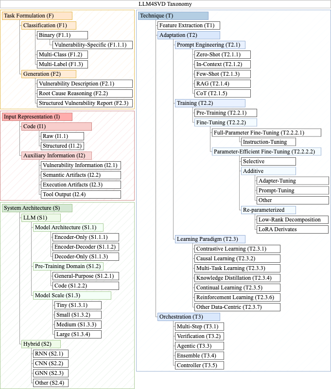

# LLM4SVD TAXONOMY 🗂️

We categorize existing LLM4SVD approaches according to detection task, input representation, system architecture, and technique. The presented taxonomy allows for meaningful comparison and benchmarking of studies.   

